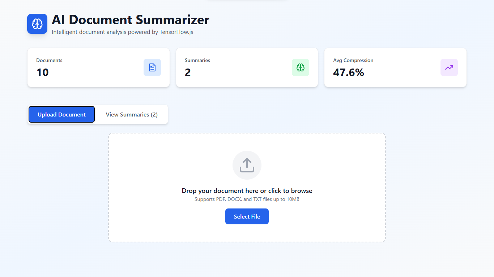

# AI-Powered Document Summarizer

A modern, fast, and intuitive **AI-powered document summarization tool** that helps users condense long PDFs, articles, and text files into clear and concise summaries. Built with cutting-edge technologies like **React**, **Node.js**, **MongoDB**, and **TensorFlow.js**, this project delivers efficient NLP-driven insights with a smooth user experience.



---

## 🚀 Features

- **AI-Based Summarization** – Uses NLP models powered by TensorFlow.js to generate accurate and concise summaries.
- **Multi-Format Support** – Upload and summarize PDF, TXT, and DOCX files.
- **Real-Time Processing** – Fast server responses using Node.js.
- **Modern UI** – Clean and responsive interface built with React.
- **Document History** – Stores past summaries using MongoDB.
- **Secure API** – Well-structured backend with proper routing and validation.

---

## 🛠️ Tech Stack

### **Frontend**

- React
- Tailwind CSS / CSS Modules
- Vite (optional)

### **Backend**

- Node.js
- Express.js
- TensorFlow.js (NLP models)

### **Database**

- MongoDB / Mongoose

### **Others**

- JWT Authentication
- REST API Architecture

---

## 📦 Installation

### **1. Clone the Repository**

```bash
git clone https://github.com/Tatakai7/AI_Powered_Document_Summarizer.git
cd AI_Powered_Document_Summarizer
```

### **2. Install Dependencies**

```bash
# Install backend dependencies
cd AI_Powered_Document_Summarizer/server/
npm install

# Install frontend dependencies
cd AI_Powered_Document_Summarizer/src/
npm install
```

### **3. Environment Variables**

Create `.env` file in the **server** directory:

```bash
MONGO_URI=your_mongodb_connection_string
JWT_SECRET=your_jwt_secret_key
PORT=5000
```

---

## ▶️ Running the Project

### **Start Backend**

```bash
cd AI_Powered_Document_Summarizer/server/
npm start
```

### **Start Frontend**

```bash
cd AI_Powered_Document_Summarizer/src/
npm run dev
```

> The app will be available at: **[http://localhost:5173](http://localhost:5173)**

---

## 📘 API Endpoints

### **POST /api/summarize**

Uploads and summarizes a document.

### **GET /api/history**

Fetches stored summary history.

### **POST /api/auth/login**

Authenticates users.

---

## 📂 Folder Structure

```bash
AI_Powered_Document_Summarizer/
│
├── src/               # React frontend
│   ├── components/
│   ├── services/
│   ├── types/
│   ├── utils/
│   └── ...
│
├── server/            # Node.js backend
│   ├── config/
│   ├── middleware/
│   ├── models/
│   ├── routes/
│   ├── services/
│   └── ...
│
└── README.md
```

---

## 🧠 How It Works

1. User uploads a document.
2. Backend extracts raw text.
3. TensorFlow.js NLP model processes the text.
4. Model generates a structured, concise summary.
5. Summary is returned to the UI and saved in MongoDB.

---

## 🤝 Contributing

Contributions are welcome! Submit issues or create pull requests.

---

## 📝 License

This project is licensed under the **GPL 3.0 License**.

---

1. Problem Statement
   In today’s digital world, people often deal with long articles, reports, and documents. Reading everything word-for-word can be time-consuming and inefficient.

   Our solution addresses this problem by allowing users to upload or input text, which is then processed by an AI model to generate a clear and accurate summary.

---

2. High-Level System Architecture
   The system follows a client–server architecture and is composed of three major layers:
   1. Frontend (User Interface)
      • Allows users to upload documents or paste text
      • Displays the generated summary

   2. Backend API
      • Receives document data
      • Handles preprocessing and request validation
      • Communicates with the AI summarization engine

   3. AI Summarization Engine
      • Processes the text using NLP techniques
      • Generates a concise summary
      • Sends the result back to the backend
      This separation ensures scalability, maintainability, and security.

---

3. Application Setup and Deployment
   The application is packaged as a complete project and can be launched locally using standard development tools.

   The backend server initializes the API routes, while the frontend connects to the API to send and receive data.

   Configuration files such as environment variables are used to manage sensitive settings like API keys and server ports.

---

4. Frontend System Walkthrough

   4.1 User Interface Overview
   When the application loads, the user is presented with a clean and simple interface.

   The interface includes:
   • A text input area or file upload option
   • A button to generate the summary
   • A section where the summarized output is displayed
   The design focuses on usability and clarity, ensuring that even non-technical users can use the system easily.

   4.2 User Interaction Flow
   The user can:
   1. Paste a long text document into the input field or
   2. Upload a document file for summarization
      Once the input is ready, the user clicks the “Summarize” button.

---

5. Backend System Walkthrough

   5.1 API Entry Point
   When the user clicks the summarize button, the frontend sends a request to the backend API.

   The backend:
   • Validates the input
   • Ensures the text is not empty
   • Prepares the content for AI processing

   5.2 Preprocessing
   Before sending the text to the AI model, the backend performs preprocessing such as:

   • Removing unnecessary characters
   • Normalizing text
   • Handling large document sizes
   This step ensures better summarization accuracy.

---

6. AI Summarization Process
   The core feature of the system is the AI summarization engine.

   The engine uses Natural Language Processing techniques to:

   • Analyze sentence importance
   • Detect key themes and topics
   • Preserve the main idea of the document
   Instead of simply shortening the text, the model generates a meaningful and coherent summary that reflects the original content.

---

7. End-to-End Demonstration
   Let me now demonstrate the full system flow.
   1. I input a long document into the text field
   2. I click the Summarize button
   3. The frontend sends the document to the backend API
   4. The backend processes the request and forwards it to the AI model
   5. The AI generates a summarized version of the document
   6. The backend sends the summary back to the frontend
   7. The summary is displayed instantly on the screen
      This confirms that the frontend, backend, and AI engine are fully integrated and working together.

---

8. Error Handling and Validation
   The system also includes proper error handling.

   For example:

   • If no text is provided, the user is notified
   • If the document is too large, a warning is shown
   • If the server encounters an issue, a friendly error message is displayed
   This improves reliability and user experience.

---

9. Performance and Efficiency
   The summarization process is optimized to:

   • Handle large documents efficiently
   • Return results within a short time
   • Avoid unnecessary processing overhead
   This makes the application practical for real-world usage.

---

10. Security and Best Practices

    The application follows best practices such as:

    • Input validation to prevent malicious requests
    • Separation of frontend and backend responsibilities
    • Secure handling of environment variables
    • Modular and maintainable code structure

---

11. Conclusion

    In conclusion, the AI-Powered Document Summarizer successfully demonstrates:

    • Practical use of Artificial Intelligence
    • Effective frontend-backend integration
    • Real-world problem solving using NLP
    • Clean system architecture and design

    This project can be further enhanced by adding:

    • Multi-language summarization
    • Adjustable summary length
    • PDF and Word document support
    • User authentication and summary history

---

# 🔌 Integrated APIs and Built Features

AI-Powered Document Summarizer

1. Document Summarization API
   Base Route:
   /summarize (or similar backend endpoint)

   What it does
   • Receives raw text or document content from the frontend
   • Sends the text to the AI/NLP summarization engine
   • Processes and generates a concise summary
   • Returns the summarized text to the client

   What it builds in the system
   ✅ Core AI summarization feature
   ✅ Automatic text condensation
   ✅ Meaning-preserving summaries
   ✅ NLP-powered content understanding

---

2. File Upload API (if supported)
   Base Route:
   /upload

   What it does
   • Accepts uploaded document files (e.g., TXT, PDF, DOCX)
   • Extracts readable text from files
   • Prepares text for summarization

   What it builds in the system
   ✅ Document upload functionality
   ✅ File-to-text conversion
   ✅ Support for real-world documents

---

3. Text Preprocessing API
   Internal API / Middleware

   What it does
   • Cleans and normalizes text
   • Removes unnecessary characters and formatting
   • Handles large document chunking
   • Ensures text is AI-ready

   What it builds in the system
   ✅ Improved summary accuracy
   ✅ Stable AI input handling
   ✅ Performance optimization

---

4. AI / NLP Model API
   Type:
   Local model or third-party AI service (depending on implementation)

   What it does
   • Analyzes sentence importance
   • Identifies key topics and themes
   • Generates coherent summaries using NLP techniques

   What it builds in the system
   ✅ Artificial intelligence capability
   ✅ Natural language understanding
   ✅ Context-aware summaries

---

5. Backend Core API (Server API)
   Base URL:
   http://localhost:<port>

   What it does
   • Acts as the central controller
   • Handles client requests and responses
   • Connects frontend to AI engine
   • Manages application logic

   What it builds in the system
   ✅ Frontend–backend communication
   ✅ Scalable system architecture
   ✅ Secure data flow

---

6. Frontend API Integration (Fetch / Axios)

   What it does
   • Sends user input to backend APIs
   • Receives summarized output
   • Handles loading states and errors

   What it builds in the system
   ✅ Interactive UI behavior
   ✅ Real-time summary display
   ✅ Smooth user experience

---

7. Environment Configuration API (.env)

   What it does
   • Stores sensitive values such as API keys and ports
   • Separates development and production settings

   What it builds in the system
   ✅ Secure configuration management
   ✅ Flexible deployment setup
